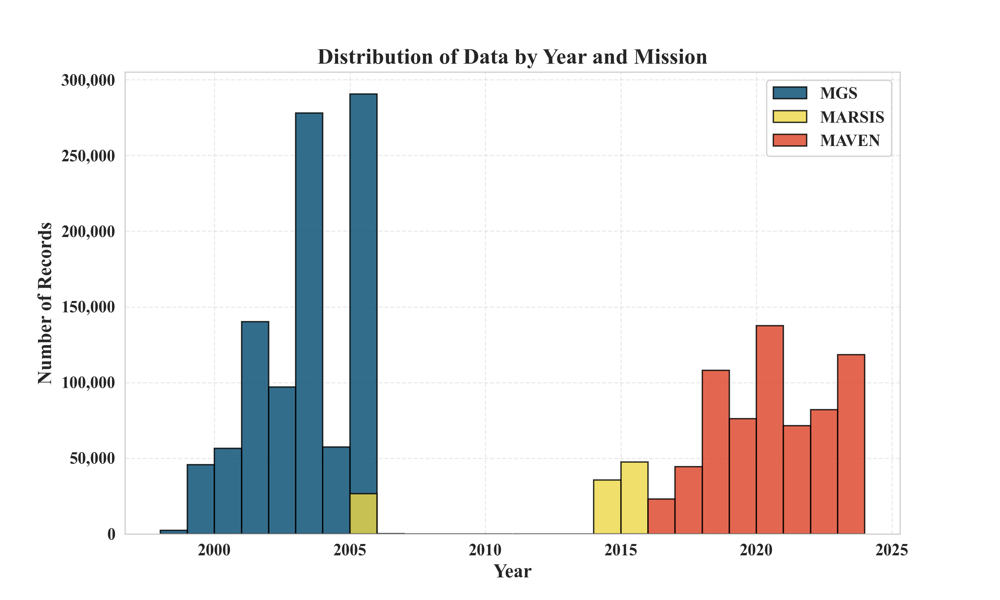
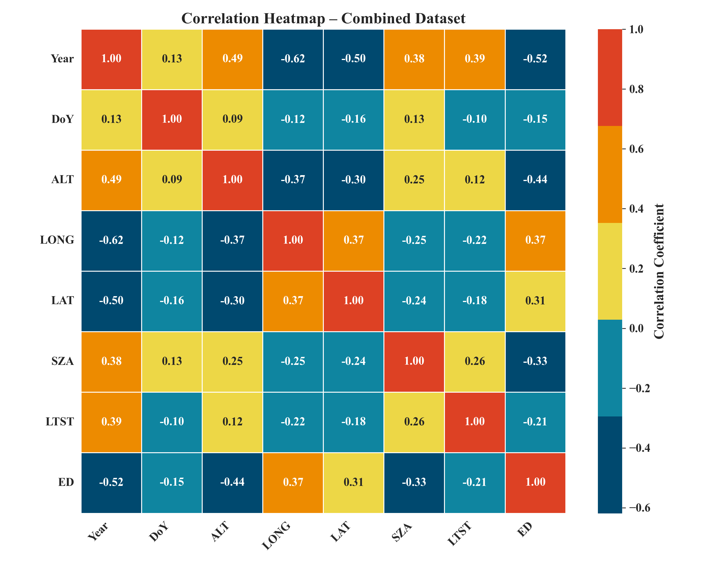
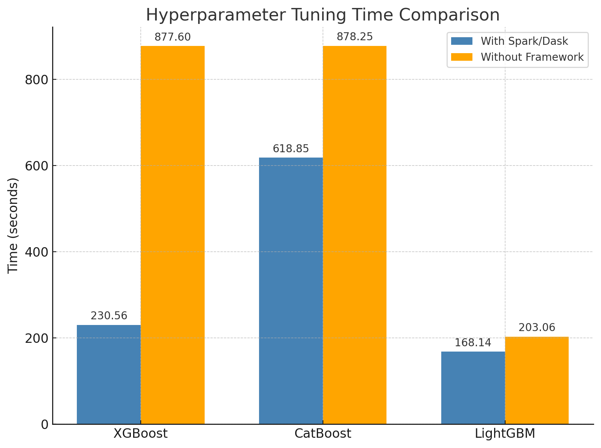
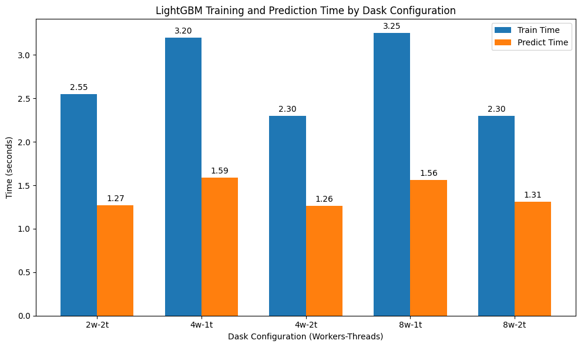

# Gradient-Boosting Methods for Martian Electron Density Prediction Using Big Data Frameworks

[](https://www.python.org/)
[](https://spark.apache.org/)
[](https://www.dask.org/)
[](https://xgboost.readthedocs.io/)
[](https://lightgbm.readthedocs.io/)
[](https://catboost.ai/)
[](https://ieeexplore.ieee.org/document/11473159)
[](LICENSE)

> A distributed machine-learning pipeline that predicts the **Martian ionospheric Electron Density Profile (EDP)** by combining data from three NASA/ESA missions — **MGS, Mars Express (MARSIS), and MAVEN** — and benchmarking three state-of-the-art gradient-boosting models (**XGBoost, LightGBM, CatBoost**) on top of **Apache Spark** and **Dask**.

📄 **Published in IEEE Xplore:** [Read the paper](https://ieeexplore.ieee.org/document/11473159)

---

## Architecture Overview

<p align="center">
  
  <br/>
  <em>Figure 1 — End-to-end pipeline: dataset preprocessing, fusion of MGS / MARSIS / MAVEN, distributed configuration selection (Spark/Dask), hyperparameter tuning, and optimal model selection.</em>
</p>

---

## Table of Contents

- [Motivation](#motivation)
- [Key Highlights](#key-highlights)
- [Tech Stack](#tech-stack)
- [Datasets](#datasets)
- [Methodology](#methodology)
- [Exploratory Data Analysis](#exploratory-data-analysis)
- [Results](#results)
- [Repository Structure](#repository-structure)
- [Getting Started](#getting-started)
- [Citation](#citation)
- [License](#license)
- [Contact](#contact)

---

## Motivation

Modeling the **Martian ionosphere** has been a central focus of planetary research since the first exploration missions to Mars. Existing approaches rely heavily on empirical or semi-empirical models, while machine learning remains comparatively underexplored despite the steady growth of in-situ mission data.

This project closes that gap by:

1. **Fusing three multi-decade Mars-mission datasets** into a single, unified EDP prediction problem.
2. **Predicting the full Electron Density Profile across all altitudes** rather than a single point estimate.
3. **Scaling the workflow horizontally** with Apache Spark and Dask so that hyperparameter tuning over the combined dataset is tractable on commodity hardware.

---

## Key Highlights

- **Multi-mission data fusion** — MGS (1998–2005), Mars Express / MARSIS (2005–2015), and MAVEN (2014–present) unified into one training set.
- **Three gradient-boosting frameworks benchmarked end-to-end** — XGBoost, LightGBM, and CatBoost.
- **Two distributed back-ends compared** — Apache Spark and Dask, with systematic configuration sweeps (workers × threads).
- **Hyperparameter tuning accelerated by up to ~3.8×** vs. the non-distributed baseline.
- **LightGBM** delivers the best **predictive accuracy**; **XGBoost** delivers the best **train/inference time**.
- **Reproducible pipeline** — preprocessing, configuration selection, training, and evaluation are modular.

---

## Tech Stack

| Layer | Tools |
|---|---|
| Language | Python 3.9+ |
| Distributed Compute | Apache Spark, Dask |
| ML Models | XGBoost, LightGBM, CatBoost |
| Data | pandas, NumPy, PyArrow |
| Tuning & Validation | scikit-learn (GridSearchCV, cross-validation) |
| Visualization | Matplotlib, Seaborn |
| Environment | Jupyter Notebook |

---

## Datasets

The combined dataset spans roughly **two decades of Martian ionospheric observations** from three missions:

| Mission | Instrument / Source | Approximate Coverage |
|---|---|---|
| **MGS** — Mars Global Surveyor | Radio Science | 1998 – 2005 |
| **Mars Express** | MARSIS | 2005 – 2015 |
| **MAVEN** — Mars Atmosphere and Volatile Evolution | NGIMS / Radio Occultation | 2014 – Present |

<p align="center">
  
  <br/>
  <em>Figure 2 — Distribution of records by year and mission. The gap between the MGS era and the MAVEN era illustrates the value of cross-mission fusion.</em>
</p>

**Features used:** Year, Day-of-Year (`DoY`), Altitude (`ALT`), Longitude (`LONG`), Latitude (`LAT`), Solar Zenith Angle (`SZA`), Local True Solar Time (`LTST`).
**Target:** Electron Density (`ED`).

---

## Methodology

The framework (see *Figure 1*) follows four stages:

1. **Preprocessing & Fusion** — harmonize units, handle missing values, and concatenate MGS, MARSIS, and MAVEN records into a single feature matrix.
2. **Distributed Configuration Selection** — sweep Spark / Dask worker × thread combinations to identify the optimal compute layout for each model.
3. **Model Training & Hyperparameter Tuning** — Grid Search + cross-validation for XGBoost, LightGBM, and CatBoost, executed in parallel through the chosen distributed back-end.
4. **Performance Evaluation & Optimal Model Selection** — compare predictive accuracy and wall-clock time to select the best model–framework pair.

---

## Exploratory Data Analysis

<p align="center">
  
  <br/>
  <em>Figure 3 — Pearson correlation heatmap of the combined dataset. Electron Density (<code>ED</code>) is most strongly anti-correlated with <code>Year</code> (-0.52) and <code>ALT</code> (-0.44), and positively correlated with <code>LONG</code> (0.37) and <code>LAT</code> (0.31), confirming the physical expectation that ED varies with altitude and solar conditions.</em>
</p>

---

## Results

### 1. Hyperparameter-Tuning Time — With vs. Without Distributed Framework

<p align="center">
  
  <br/>
  <em>Figure 4 — Hyperparameter tuning time (seconds), with vs. without Spark / Dask.</em>
</p>

| Model | Without Framework (s) | With Spark/Dask (s) | Speed-Up |
|---|---:|---:|---:|
| XGBoost | 877.60 | **230.56** | **3.8×** |
| CatBoost | 878.25 | 618.85 | 1.4× |
| LightGBM | 203.06 | **168.14** | 1.2× |

> **Takeaway:** XGBoost benefits the most from distribution; LightGBM is already fast on a single node.

### 2. LightGBM — Train & Predict Time across Dask Configurations

<p align="center">
  
  <br/>
  <em>Figure 5 — LightGBM training and prediction time across Dask worker × thread configurations.</em>
</p>

| Dask Config (Workers × Threads) | Train Time (s) | Predict Time (s) |
|---|---:|---:|
| 2w × 2t | 2.55 | 1.27 |
| 4w × 1t | 3.20 | 1.59 |
| **4w × 2t** | **2.30** | **1.26** |
| 8w × 1t | 3.25 | 1.56 |
| 8w × 2t | 2.30 | 1.31 |

> **Takeaway:** **4 workers × 2 threads** is the sweet spot — adding more workers without more threads (8w × 1t) actually *hurts* performance due to scheduling overhead.

### Final Model Selection

| Criterion | Winner |
|---|---|
| Highest predictive accuracy | **LightGBM** |
| Fastest train + inference | **XGBoost** |
| Best parallel speed-up | **XGBoost** (3.8× on Spark/Dask) |

---

## Repository Structure

```
.
├── data/                      # Raw + preprocessed mission datasets (not tracked)
├── notebooks/                 # Jupyter notebooks for EDA and experiments
├── src/
│   ├── preprocessing/         # Dataset cleaning & fusion
│   ├── distributed/           # Spark & Dask configuration utilities
│   ├── models/                # XGBoost / LightGBM / CatBoost training scripts
│   └── evaluation/            # Metrics & benchmarking
├── images/                    # Figures used in this README
├── requirements.txt
├── LICENSE
└── README.md
```

---

## Getting Started

### 1. Clone the repository
```bash
git clone https://github.com/MAK1406/Gradient-Distributing-Methods-for-Martian-Electron-Density-Prediction-Using-big-Data-Frameworks.git
cd Gradient-Distributing-Methods-for-Martian-Electron-Density-Prediction-Using-big-Data-Frameworks
```

### 2. Create the environment
```bash
python -m venv .venv
source .venv/bin/activate          # On Windows: .venv\Scripts\activate
pip install -r requirements.txt
```

### 3. Run an experiment
```bash
# Example: train LightGBM with Dask (4 workers × 2 threads)
python src/models/train_lightgbm.py --backend dask --workers 4 --threads 2
```

---

## Citation

If you use this work, please cite the IEEE paper:

```bibtex
@INPROCEEDINGS{11473159,
  author={Abusirdaneh, Manar Anwer and Abul, Osman},
  booktitle={2025 International Conference on Computational Intelligence, Security, and Artificial Intelligence (IntelliSecAI)}, 
  title={Big Data Frameworks for Predicting Martian Ionospheric Electron Density Using Distributed Gradient Methods}, 
  year={2025},
  volume={},
  number={},
  pages={1-7},
  keywords={Interplanetary exploration;Space exploration;Space missions;Central Processing Unit;Contacts;Electronic circuits;Protocols;HTTP;Radio access networks;Regional area networks;Martian Ionosphere;Electron Density;Machine Learning;Xgboost;Lightgbm;Catboost;MGS;MARSIS;MAVEN;Big Data;Apache Spark;Dask},
  doi={10.1109/IntelliSecAI66368.2025.11473159}}

```

**IEEE format:**
M. A. Abusirdaneh and O. Abul, "Big Data Frameworks for Predicting Martian Ionospheric Electron Density Using Distributed Gradient Methods," 2025 International Conference on Computational Intelligence, Security, and Artificial Intelligence (IntelliSecAI), Al-Khobar, Saudi Arabia, 2025, pp. 1-7, doi: 10.1109/IntelliSecAI66368.2025.11473159.

---

## License

This project is licensed under the MIT License — see the [LICENSE](LICENSE) file for details.

---

## Contact

**Manar Anwar**
📧 mabusirdaneh@outlook.com
🔗 [GitHub @MAK1406](https://github.com/MAK1406)

---

<p align="center"><em>If you find this work useful, please ⭐ the repo — it helps others discover it.</em></p>
